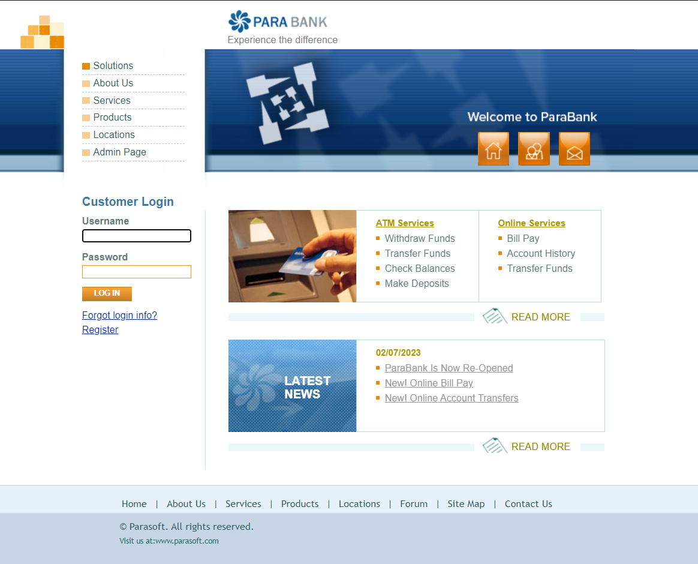

# Portfólio Para Bank

Projeto destinado a testar a aplicação Para Bank

### Sobre a aplicação
Sistema Web Open Source de uma aplicação bancária. 

[Link para aplicação](https://parabank.parasoft.com/parabank/index.htm)



### Análise do Projeto

A análise técnica do projeto foi desenvolvida no MIRO, utilizando a técnica de Storytelling das funcionalidades. 
É possível observar a análise dos seguintes pontos de vista: 

- User Story
- Regras de Negocio


### Levantamento de Requisitos

O Levantamento de requsitos das funcionalidades foram adicionadas no Excell, que pode ser consulta na caminho abaixo. 

```
.
├── iframes
├── img
    └── parabank.png
├── levantamentoRequisitos
    └── img
    └── Levantamento de Requisitos.xlsx
    └── Readme.md
├── README.md
└── analise_miro_embed.html

```

1 - **iframes**: codigo embed do miro para melhor visualização 

2 - **img**: arquivos de imagem que estão linkados no arquivo Readme.md

3 - **levantamentoRequisitos**: pasta com arquivo excell contendo a análise completa do projeto  (em breve)

4 - **plano de teste**: será armazenado o plano de teste. (em breve)


### Contato

Priscila Caimi | Mentora de Carreira Tech | Engenheira de Software
e-mail: priscila.caimi@hotmail.com

[](https://github.com/pricaimiTech)
