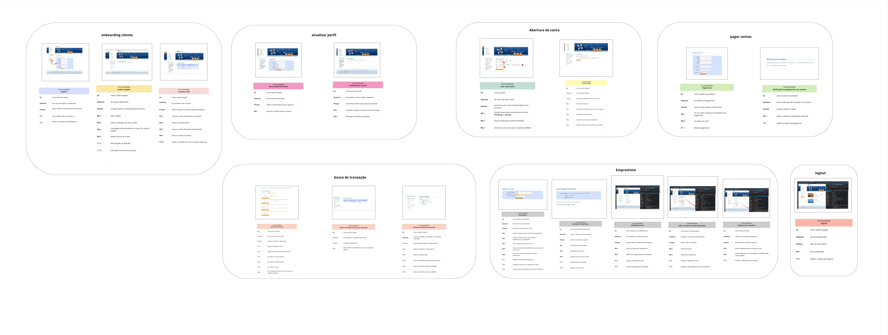

# Análise Portfólio Para Bank

Análise de negócio do site.

### Análise do Projeto

A análise técnica do projeto foi desenvolvida no MIRO, utilizando a técnica de Storytelling das funcionalidades. 
É possível observar a análise dos seguintes pontos de vista: 

- User Story
- Regras de Negocio

Veja a análise do MIRO

Veja a Planilha de Análise de Projeto no excell [Análise](levantamentoRequisitos/Parabank de Levantamento de Requisitos.xlsx)

### Contato

Priscila Caimi | Mentora de Carreira Tech | Engenheira de Software
e-mail: priscila.caimi@hotmail.com

